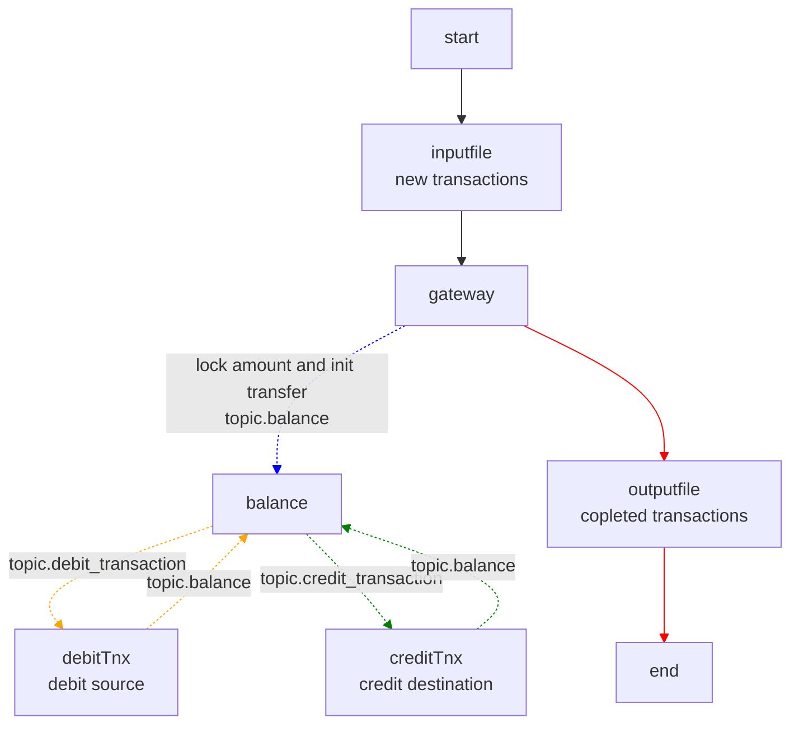

# playground-dapr (work in progress)


```
zipkin: localhost:9411
redis commander: localhost:8081
dapr dashboard: localhost:9000
adminer: localhost:8080
    System: SQLite 3
    Username:
    Password: pass
    Database: /db/main.db
```

Plan:




TODO:
- setup k0s cluster
- install redis, nats, postgres, vault?, grafana? with helm
- port dapr app to k8s
- scale to zero with keda.sh
- check how to debug with Bridge to k8s/dapr
- check grafana loki/tempo
- check debezium

