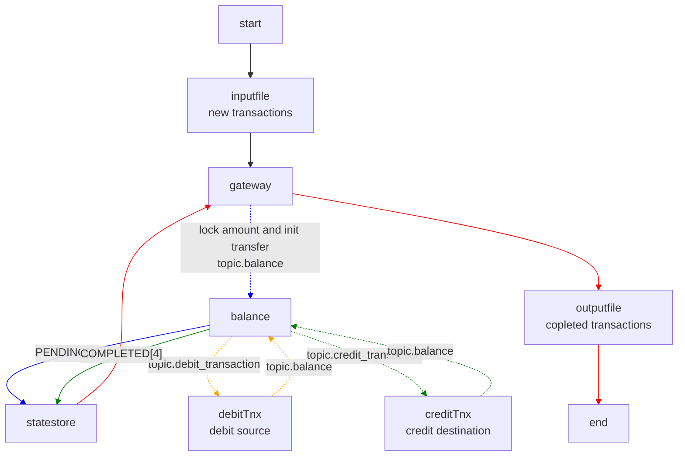

# playground-dapr (work in progress)


```
zipkin: localhost:9411
redis commander: localhost:8081
dapr dashboard: localhost:9000
adminer: localhost:8080
    System: SQLite 3
    Username:
    Password: pass
    Database: /db/main.db
```

Plan:


